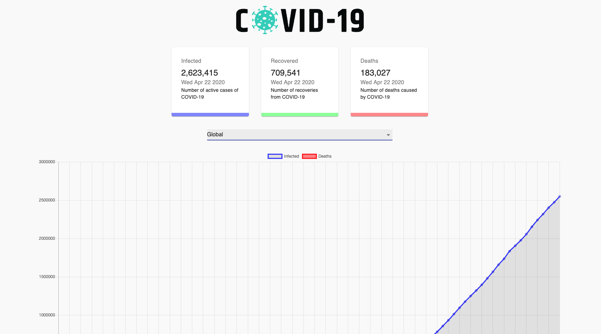
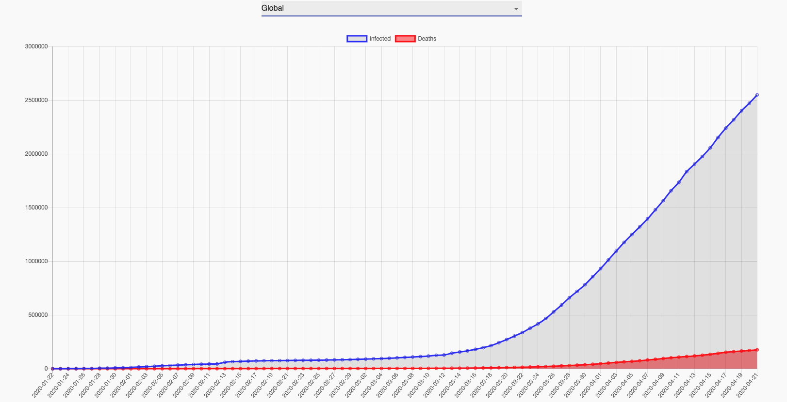
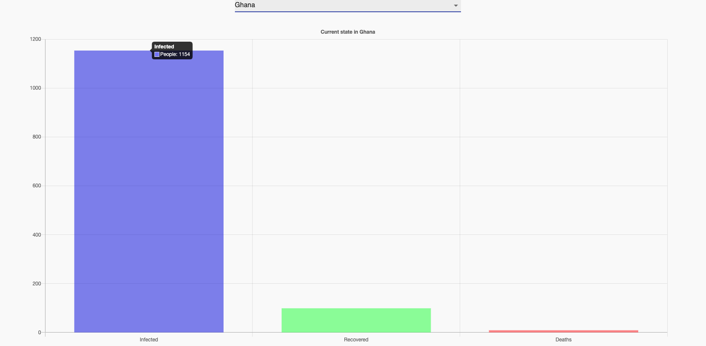

# Covid-19 Tracker

## Problem

> Finding just statistics for COVID-19 was very difficult. 
> To save time, I have created this tracker as a helper to mgo straight to  
> the statistics when I want them.
> This tracker uses an API (https://covid19.mathdro.id/api).

#### Technology Used

> React, JavaScript, CSS, NPM, Chartjs, MaterialUI and Axios
> [Check out Covid-19 Tracker](https://covid-19-tracker-michael-anokye.netlify.app/ "Link to Covid-19 Tracker").

## Global Home Screen

> Covid-19 Tracker welcomes you with a home screen where you get the global statistics
> with 3 cards showing infected, recovered and death numbers
> and a line chart for these numbers.
> 
> 

## Country BarChart

> You can select a country to get the statisctics from that country.
> 

## Video Demo

> Below is a video demo of how Covid-19 works.
> 
